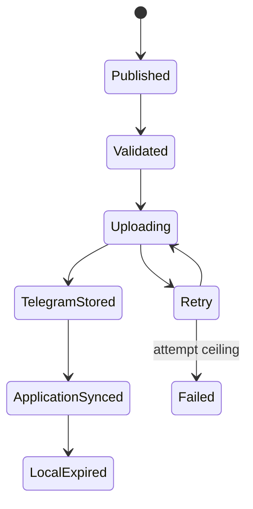

# Architecture

## Trust boundaries

The workstation controller holds SSH authority only for the duration of an operation. The WordPress application never receives root or SSH authority. The node worker receives a single application callback secret and the Telegram transport credentials. The Local Bot API binds to loopback and is not externally routable.

## Recording state model

Local deletion is permitted only after the queue receipt is in `done` and the local grace interval has elapsed. A transport failure never qualifies media for deletion.

## Idempotency

- Provisioning uses stable paths and systemd unit names.
- Queue identity is the immutable BBB recording identifier.
- WordPress enforces a unique key on `record_id`.
- Callback retries update the same transport row.
- Existing booking and learning-session links are not overwritten when already populated.
- Telegram upload is single-concurrency to limit CPU, disk, and network contention.

## Authentication

Callbacks sign `timestamp + '.' + raw_body` using HMAC-SHA256. The receiver rejects timestamps outside a five-minute window and compares signatures using constant-time equality. HTTPS is mandatory between the node and WordPress.

## Transport reuse

The archive upload produces a bot-scoped `file_id`. Subsequent student delivery uses that identifier and does not read the local recording. The archive channel message and its identifiers are retained as recovery references.
